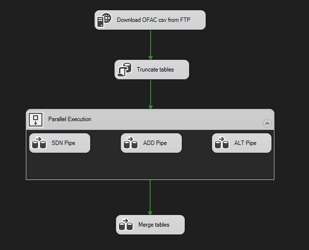
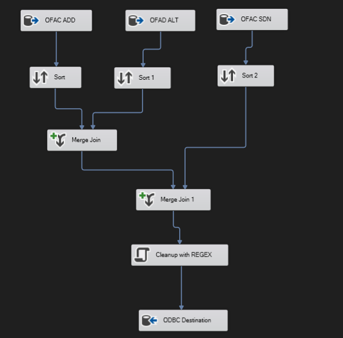

This repository contains my submissions for Josh Dev's [First End-To-End Data Portfolio](https://www.youtube.com/playlist?list=PLtomnyC4qhTwqcZ3DzBhewMNjM_4rHqnO)

## Project Overview


### Week 1
An FTP server was set up in WSL Ubuntu using the instructions specified in [wsl_ftp.md](week_1/wsl_ftp.md). Several _csv_ files were then downloaded from the internet and subsequently uploaded to the FTP server using a [python script](week_1/load_to_ftp.py). The datasets used in this project were taken from [The Office of Foreign Assets Control - U.S Department of Treasury](https://ofac.treasury.gov/specially-designated-nationals-list-data-formats-data-schemas)

* [SDN.csv](https://www.treasury.gov/ofac/downloads/sdn.csv)
* [ADD.csv](https://www.treasury.gov/ofac/downloads/add.csv)
* [ALT.csv](https://www.treasury.gov/ofac/downloads/alt.csv)

### Week 2
Visual Studio SSIS (SQL Server Integration Services) was used to load the extracted _csv_ files from the FTP server into a PostgreSQL database. The control flow and data flow is show below:

Control Flow:




Merge Table Data Flow:



### Week 3
A simple screening [API](week_3/screening_api.py) was created using FastAPI. The API has one endpoint which is `/screen` where the user adds the parameter `name` that they want to screen against the database from week 2. The endpoint also accepts the following optional paramterers.
* `threshold` (for Levenshtein Distance comparisons)
* `is_sorted` 

## Configuration

The following environment variables were set in the virtual environment in *Activate.ps1* 

```
# FTP Variables

$Env:FTPHOST = <wsl ip address>
$Env:FTPUSER = <ftp username>
$Env:FTPPASS = <ftp password>
$Env:FTPPORT = <ftp port>

# POSTGRES Variables

$Env:DBHOST = <postgre host>
$Env:DBPORT = <postgre port>
$Env:DBNAME = <postgre database name>
$Env:DBUSER = <postgre username>
$Env:DBPASS = <postgre password>
```
